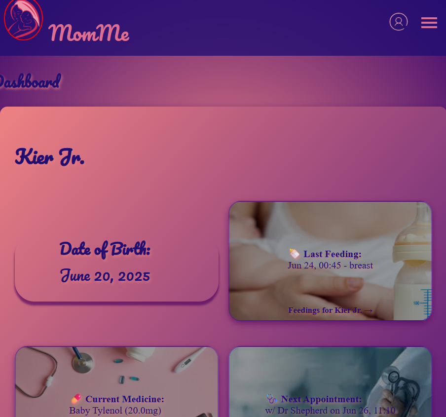

**MomMe** is a web application designed to help moms effortlessly track their babies’ **feedings**, **diaper changes**, **medications**, and **appointments** — all in one organized place.

---

## 🌟 Features

- 📊 **Dashboard** with an overview of recent activity per baby  
- 🍼 **Feedings** – Track what, when, and how much your baby eats  
- 💊 **Medications** – Keep tabs on medicine name, dosage, and timing  
- 💩 **Diaper Changes** – Record types and times of each diaper change  
- 📅 **Appointments** – Schedule, view, and update doctor visits or checkups  
- 👩‍👧 **Multiple babies** support per user  
- ✅ **Full CRUD** support for all activity logs  

---

## 🧑‍💻 Tech Stack

| Layer        | Technology         |
|--------------|--------------------|
| Backend      | Python, Django     |
| Database     | PostgreSQL         |
| Frontend     | HTML, CSS, JavaScript (Django templates) |
| Deployment   | Heroku (or your platform of choice) |

---

## 🔐 Authentication

- 🔒 Secure login/logout system
- Each user’s data is private and scoped to their account

---

## 📷 Screenshots

> _Ensure these paths are correct if using local screenshots or host them on a service like Imgur or GitHub Issues for public display._




---

## 🚀 Getting Started

### 1. Clone the Repository

```bash
git clone https://github.com/yourusername/momme.git
cd momme
